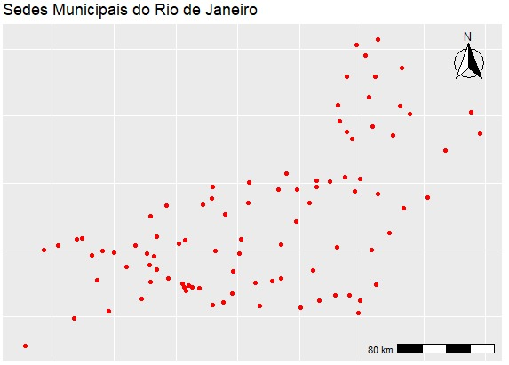
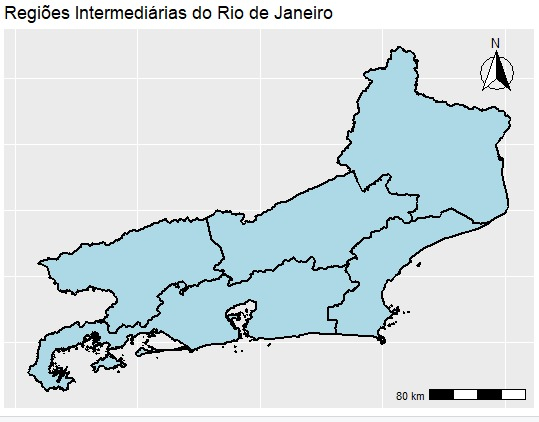
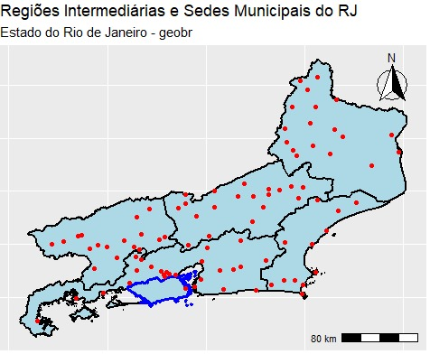

::: {style="width: 100%; text-align: center; margin-top: 200px;"}

<h2 style="font-size: 110px; margin: 0;">
INTRODUÇÃO

</h2>

:::
---

<h2 style="font-size: 60px; margin: 0;"> 

PROPRIEDADES DAS FUNÇÕES

</h2>  

| Aspecto | read_municipal_seat() | read_intermediate_region() |
|---|---|---|
| Geometria | POINT | MULTIPOLYGON |
| Representa | Sedes municipais | Regiões intermediárias |
| Escala | Municipal | Regional/intermediária |
| Objetivo | Localizar cidades | Representar áreas de influência |

---

::: {style="width: 100%; text-align: center; margin-top: 200px;"}

<h2 style="font-size: 110px; margin: 0;">

EXPLORAÇÃO DA FUNÇÃO

</h2>

:::

---

<h2 style="font-size: 60px; margin: 0;"> 

ESPECIFICAÇÕES (read_municiple_seat())

</h2>

- Entre os principais argumentos, temos: year,code_muni,output.
- No argumento year temos os anos: de 1872 à 2022.
- A função retorna geometrias do tipo POINT.

---

<h2 style="font-size: 60px; margin: 0;"> 

ESPECIFICAÇÕES (read_municiple_seat())

</h2>

- O objeto retornado pertence a classe sf, contendo atributos em formato tabular, coluna geometrica e coordenadas espaciais das sedes municipais
- Entre as principais colunas estão as que indicam código e nome do município, sigla  e nome do estado, coordenadas espaciais e geometria do ponto.

---

<h2 style="font-size: 60px; margin: 0;"> 

ESPECIFICAÇÕES (read_intermediate_region())

</h2>

- Entre os principais argumentos, temos: year,
code_intermediate, output.
- No argumento year temos os anos: de 2019 à 2025.
- A função retorna geometrias do tipo MULTIPOLYGON.

---
<h2 style="font-size: 60px; margin: 0;"> 

ESPECIFICAÇÕES (read_intermediate_region())

</h2>

- O objeto retornado pertence a classe sf, contendo tabela de atributos, coluna geometrica e limites espaciais das regiões intermediárias
- As principais informações incluem código e nome da região intermediária, código da unidade federativa, nome e sigla do estado e geometria espacial das regiões.

---

::: {style="width: 100%; text-align: center; margin-top: 200px;"}

<h2 style="font-size: 110px; margin: 0;">

MAPAS

</h2>

:::
---

{fig-align="center" width=75%}
---

{fig-align="center" width=75%}
---

{fig-align="center" width=70%}
---

::: {style="width: 100%; text-align: center; margin-top: 200px;"}

<h2 style="font-size: 110px; margin: 0;">

CONCLUSÃO

</h2>
:::
---

- As funções do geobr permitem visualizar diferentes tipos de geometrias espaciais;
- read_municipal_seat() representa localizações por pontos;
- read_intermediate_region() representa áreas regionais por polígonos;
- A sobreposição das camadas facilita a interpretação espacial e territorial.

---

::: {style="width: 100%; text-align: center; margin-top: 200px;"}

<h2 style="font-size: 110px; margin: 0;">

FIM

</h2>
:::
